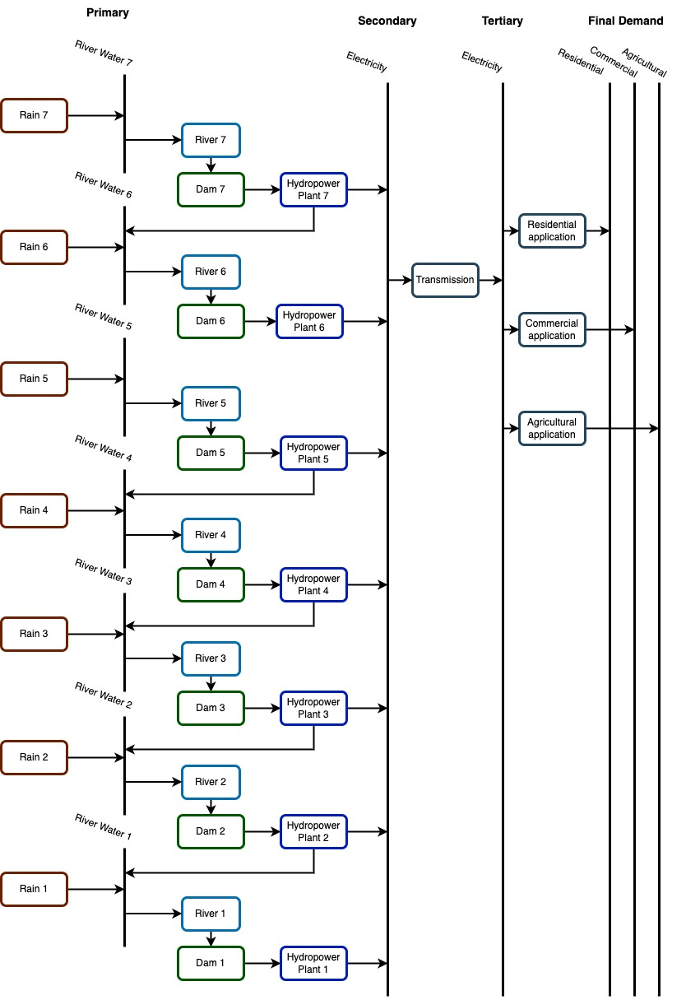

Introduction to Laos Cascade Hydropower Plants in OSeMOSYS
==============================================================

Modelling and planning the cascade hydropower system in terms of sustainable energy modelling has been a challenging decision to make due to the complexity of the multi-reservoir water system. This documentation represents tools for modelling cascading hydropower plants (HPP) using Open Source energy MOdelling SYStem `(OSeMOSYS)  <https://github.com/OSeMOSYS/OSeMOSYS_GNU_MathProg/blob/AlternateStorageCode/src/osemosys_short.txt/>`_. This project includes seven cascade HPP located on Nam Ou river in order to model energy system with a representation of the cascading hydro facilities in Lao PDR. OSeMOSYS is used due to its flexibility, functionality, and availability to run and interpret modelling scenarios. 

Lao PDR Case Study
--------------------------------------
Lao generates 85% of its electricity from hydro-electric power plants including a significant share of cascading hydro facilities. Laos is now seen as one of the richest countries in south-east Asia in terms of hydropower resources due to its geographical location and annual perception. Cost-effective energy and exporting power generated by hydropower significantly contribute to economic growth in Lao.

Structure of Model
====================================
In the following sections, a detailed explanation of open-source tools, instructions and information to model the cascade hydropower system are provided.

    Note: `OSeMOSYS_2017_11_08 <https://github.com/OSeMOSYS/OSeMOSYS_GNU_MathProg/blob/AlternateStorageCode/src/osemosys_short.txt/>`_ includes storage equations that are proper to make relationships inside the cascading hydropower plant modelling.

RES of Cascading Hydropower Plants
------------------------------------------
The Reference Energy System (RES) of the developed model simplifies the complexity of the generation of hydroelectricity from seven cascading hydropower plants located on one river, illustrated in Figure 1. The first six dams and hydropower plants already exist and are active, ant it is assumed the Nam Ou 7 including the dam and hydropower plant number 7 are the potential hydroelectric system which is planned to be built in order to address energy domestic and export electricity demand. It consists of technologies, energy carriers, fuels, and various levels of energy in the supply-demand chain. RES starts with Rain technology on the left side of the chain connected to the River Water. All required components of RES to model cascading hydropower plants are represented below:

    Figure 1: Reference Energy System of Laos Cascading Hydropower Plants

Sets
----------------------------------------------------------------------

+--------------------------------------------------------+----------------------------------------------------------------------------------------------------------------------------------------------------------------------------------------------------------------------------------------------------------------------------------------------+
| **Name**                                               | **Description**                                                                                                                                                                                                                                                                              |
+========================================================+==============================================================================================================================================================================================================================================================================================+
| YEAR                                                   | It contains all the years to be modelled in the study. The period of time under analysis in the Laos project is defined from 2020 to 2050.                                                                                                                                                   |
+--------------------------------------------------------+-----------------------------------------------------------------------------------------------------------------------------------------------------------------------------------------------------------------------------------------------------------------------+----------------------+
| SEASON                                                 | It symbolizes the number of seasons in one year which is two seasons in the Laos model. There is a dry season named Season 1 (from October to April ) and a wet season defined as Season 2 (between May and September). Seasons are indexed as “ls”.                                         |
+--------------------------------------------------------+-----------------------------------------------------------------------------------------------------------------------------------------------------------------------------------------------------------------------------------------------------------------------+----------------------+
| TIMESLICE                                              | Based on the seasonal characteristics, there are two main seasons and each one is classified into three categories. Therefore, there are a total of 6 TIMESLICEs: Season1 baseload, Season 1 intermediate, Season 1 peak, Season2 baseload, Season 2 intermediate, and Season 2 peak.        |
+--------------------------------------------------------+-----------------------------------------------------------------------------------------------------------------------------------------------------------------------------------------------------------------------------------------------------------------------+----------------------+
| DAYTYPE                                                | It indicates the different types of days in one week. This is required because the Laos model includes Storage. Due to the characteristics of the hydropower plants one DAYTYPE is defined n the model.                                                                                      |
+--------------------------------------------------------+-----------------------------------------------------------------------------------------------------------------------------------------------------------------------------------------------------------------------------------------------------------------------+----------------------+
| DAILY TIME BRACKET                                     | It is required for models including storage and indicates the number of parts that one single day is divided. There is only one Daily Time Bracket in the Laos model.                                                                                                                        |
+--------------------------------------------------------+-----------------------------------------------------------------------------------------------------------------------------------------------------------------------------------------------------------------------------------------------------------------------+----------------------+

TECHNOLOGY
-----------------------------------------------------

Technology refers to all elements in the energy system that produce, consume, convert, and transmit the fuels which are water or electricity in Laos model.

+--------------------------------------------------------+--------------------------------------------------------------------------------------------------------------------------------------------------------------------------------------------------------------------------------------------------------------------------------------------------------------------------------------------------------------------------------------------------------------------------------------------------------------------------------------------------------------------------------+
| **Name**                                               | **Description**                                                                                                                                                                                                                                                                                                                                                                                                                                                                                                                |
+========================================================+================================================================================================================================================================================================================================================================================================================================================================================================================================================================================================================================+
| RAIN                                                   | It includes rainfall in a certain watershed shown in brown boxes in Figure 1. This model starts with Rain technology producing the River Water. The regional precipitation in the watershed of each dam is identified separately, therefore, there are seven Rain technologies in Laos model                                                                                                                                                                                                                                   |
+--------------------------------------------------------+--------------------------------------------------------------------------------------------------------------------------------------------------------------------------------------------------------------------------------------------------------------------------------------------------------------------------------------------------------------------------------------------------------------------------------------------------------------------------------------------------------------------------------+
| RIVER                                                  | River technology represents natural rivers in a watershed illustrated in blue boxes in Figure 1. The input fuel of this technology is the River Water that is produced by the Rain technology. It is modelled as **Technology To Storage** providing water for dams (Storages). Although all seven cascaded HPP are located on one natural river, in this model, seven different River technologies are defined to model regional precipitation and estimate the aggregated water that returns from previous hydropower plants.|
+--------------------------------------------------------+--------------------------------------------------------------------------------------------------------------------------------------------------------------------------------------------------------------------------------------------------------------------------------------------------------------------------------------------------------------------------------------------------------------------------------------------------------------------------------------------------------------------------------+
| Hydropower Plant                                       | Hydroelectric facilities are connected to the Storage and take the River Water as input fuel to produce electricity and return the remaining water. Hydropower plant technology is modelled as the **Technology From Storage** and illustrated in navy blue boxes in Figure 1. There are 7 HPPs in the Laos project that are connected to 7 dams (storages).                                                                                                                                                                   |
+--------------------------------------------------------+--------------------------------------------------------------------------------------------------------------------------------------------------------------------------------------------------------------------------------------------------------------------------------------------------------------------------------------------------------------------------------------------------------------------------------------------------------------------------------------------------------------------------------+
| Power Transmission                                     | Once the electricity is generated it is transmitted to address end-user demands. It is shown in gray boxes in figure 1.                                                                                                                                                                                                                                                                                                                                                                                                        |
+--------------------------------------------------------+--------------------------------------------------------------------------------------------------------------------------------------------------------------------------------------------------------------------------------------------------------------------------------------------------------------------------------------------------------------------------------------------------------------------------------------------------------------------------------------------------------------------------------+

FUEL
---------------------------------

+--------------------------------------------------------+----------------------------------------------------------------------------------------------------------------------------------------------------------------------------------------------------------------------------------------------------------------------------------------------+
| **Name**                                               | **Description**                                                                                                                                                                                                                                                                              |
+========================================================+==============================================================================================================================================================================================================================================================================================+
| River Water                                            | The water produced by the Rain technology in the watershed is called River Water, the input fuel of the River technology and the output fuel of Hydropower Plants. River water is stored inside the dams (Storage) represented in Short lines in Figure 1.                                   |
+--------------------------------------------------------+-----------------------------------------------------------------------------------------------------------------------------------------------------------------------------------------------------------------------------------------------------------------------+----------------------+
| Electricity                                            | This commodity is generated by Hydropower Plant and transmitted by the Power Transmission technology to the end-users. Long black lines illustrate electricity produced by power plants and electricity after transmission in Figure 1.                                                      |
+--------------------------------------------------------+-----------------------------------------------------------------------------------------------------------------------------------------------------------------------------------------------------------------------------------------------------------------------+----------------------+
| Final Demand Fuel                                      | Residential, agricultural and commercial demands are considered the final energy demand.                                                                                                                                                                                                     |
+--------------------------------------------------------+-----------------------------------------------------------------------------------------------------------------------------------------------------------------------------------------------------------------------------------------------------------------------+----------------------+

STORAGE
-----------------------------------------
STORAGE consists of seven cascading dames located on the Nam Ou River in Laos. 

+--------------------------------------------------------+--------------------------------------------------------------------------------------------------------------------------------------------------------------------------------------------------------------------------------------------------------------------------------------------------------------------------------------------------------------------------------------------------------------------------------------------------------------------------------------------------------------------------------+
| **Name**                                               | **Description**                                                                                                                                                                                                                                                                                                                                                                                                                                                                                                                |
+========================================================+================================================================================================================================================================================================================================================================================================================================================================================================================================================================================================================================+
| STORAGE                                                | The seven cascaded dams are defined as Storage. Each dam is connected to specific River technology that conveys water into its reservoir. Storage is also connected to one specific Hydropower Plant and provides water for generating electricity.                                                                                                                                                                                                                                                                            |
+--------------------------------------------------------+--------------------------------------------------------------------------------------------------------------------------------------------------------------------------------------------------------------------------------------------------------------------------------------------------------------------------------------------------------------------------------------------------------------------------------------------------------------------------------------------------------------------------------+
| Technology To Storage                                  | The River technology is connected to the dam and provides water to be stored inside the reservoir of a specific dam. The seven River technologies are modelled Technology To Storage. While all cascaded dams are constructed on the same river, seven separate rivers are defined in this model for each dam in order to incorporate the regional precipitation and extra water received from the previous hydropower plant located on the upper side of the river. The scheme is illustrated in Figure 1.                    |
+--------------------------------------------------------+--------------------------------------------------------------------------------------------------------------------------------------------------------------------------------------------------------------------------------------------------------------------------------------------------------------------------------------------------------------------------------------------------------------------------------------------------------------------------------------------------------------------------------+
| Technology From Storage                                | Each Hydropower Plant is connected to a specific dam and harnesses the energy of stored water inside the dam to generate electricity. Hydropower Plant technology is defined as Technology From Storage.                                                                                                                                                                                                                                                                                                                       |
+--------------------------------------------------------+--------------------------------------------------------------------------------------------------------------------------------------------------------------------------------------------------------------------------------------------------------------------------------------------------------------------------------------------------------------------------------------------------------------------------------------------------------------------------------------------------------------------------------+

Parameters
-----------------------------------------
+--------------------------------------------------------+----------------------------------------------------------------------------------------------------------------------------------------------------------------------------------------------------------------------------------------------------------------------------------------------+
| **Name**                                               | **Description**                                                                                                                                                                                                                                                                              |
+========================================================+==============================================================================================================================================================================================================================================================================================+
| Conversionls                                           | This binary parameter makes a link between a specific TimeSlice and a certain Season. The first three TimeSlices are linked to Season 1, and the remaining are connected to Season 2.                                                                                                        |
+--------------------------------------------------------+-----------------------------------------------------------------------------------------------------------------------------------------------------------------------------------------------------------------------------------------------------------------------+----------------------+
| Conversionld                                           | It is a binary parameter that defines the links between certain TimeSlice and DayType. There is one DayType in the Laos model.                                                                                                                                                               |
+--------------------------------------------------------+-----------------------------------------------------------------------------------------------------------------------------------------------------------------------------------------------------------------------------------------------------------------------+----------------------+
| Conversionlh                                           | This is a binary parameter defining links between TimeSlice and certain DaylyTimeBracket.                                                                                                                                                                                                    |
+--------------------------------------------------------+-----------------------------------------------------------------------------------------------------------------------------------------------------------------------------------------------------------------------------------------------------------------------+----------------------+
| SpecifiedAnnualDemand                                  | It represents the total energy demand of a certain year in PJ.                                                                                                                                                                                                                               |
+--------------------------------------------------------+-----------------------------------------------------------------------------------------------------------------------------------------------------------------------------------------------------------------------------------------------------------------------+----------------------+
| SpecifiedDemandProfile                                 | It represents the annual portion of energy demand at a certain TimeSlice.                                                                                                                                                                                                                    |
+--------------------------------------------------------+-----------------------------------------------------------------------------------------------------------------------------------------------------------------------------------------------------------------------------------------------------------------------+----------------------+
| Conversionlh                                           | This is a binary parameter defining links between TimeSlice and certain DaylyTimeBracket.                                                                                                                                                                                                    |
+--------------------------------------------------------+-----------------------------------------------------------------------------------------------------------------------------------------------------------------------------------------------------------------------------------------------------------------------+----------------------+

License
------------------------------------------------
This work is licensed under a `Creative Commons Attribution 4.0 International License <http://creativecommons.org/licenses/by/4.0/>`_.

.. image:: https://i.creativecommons.org/l/by/4.0/88x31.png
   :width: 100

