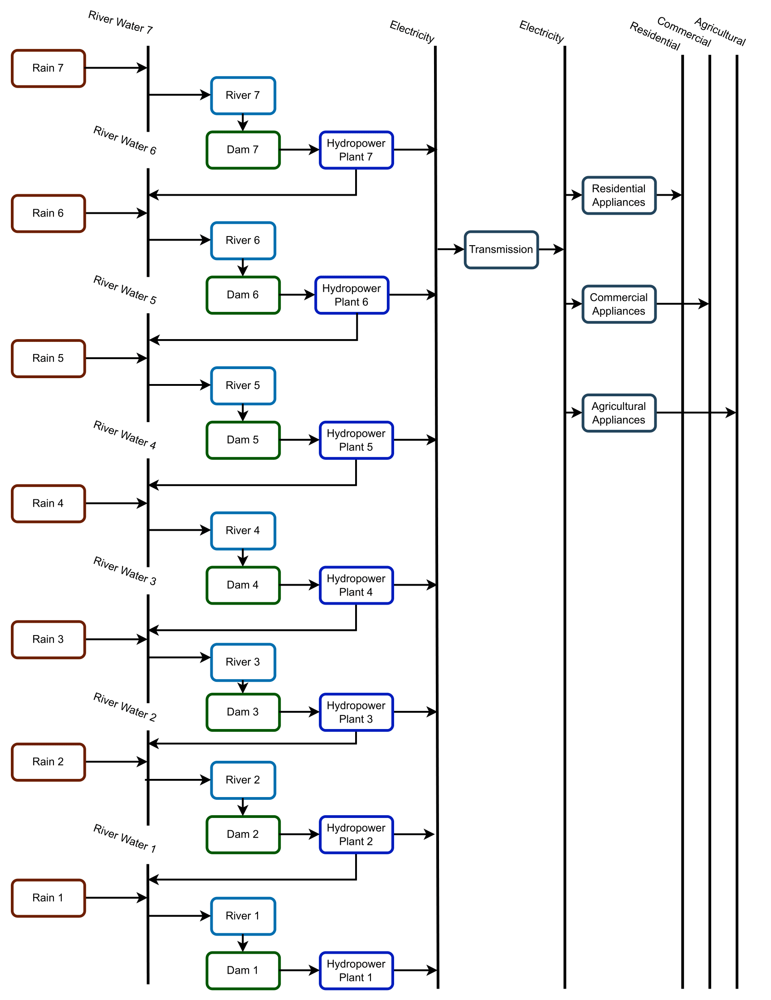
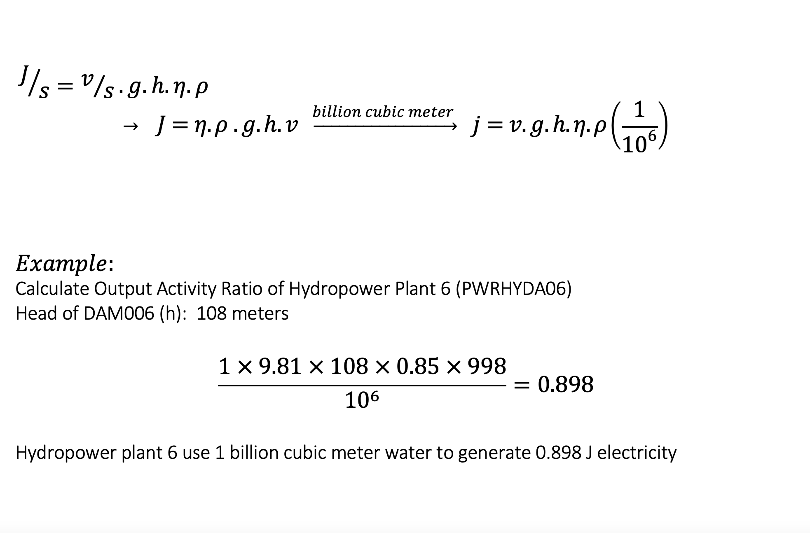
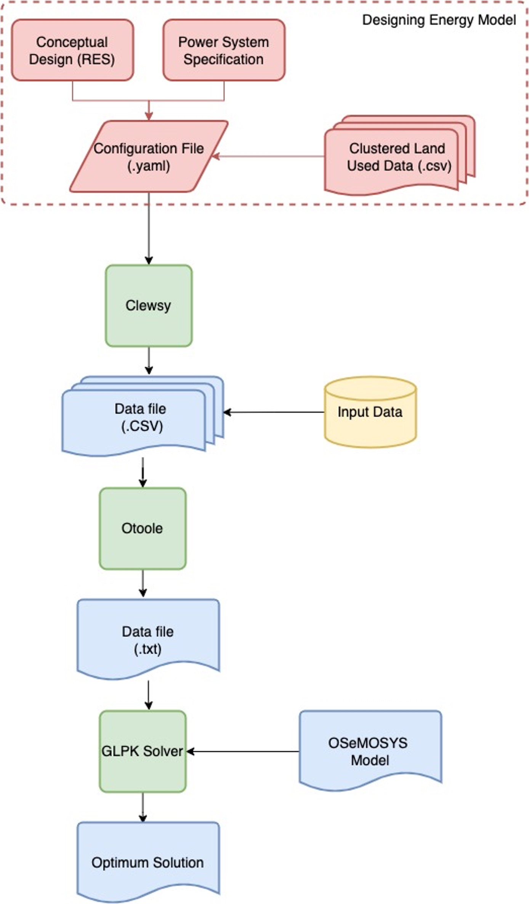

Introduction to Laos Cascade Hydropower Plants in OSeMOSYS
==============================================================
Securing access to energy for growing population and taking urgent action to mitigate climate change consequences remain as a challenge. Electricity generated by hydropower plants can accelerate clean energy transition, environmental protection, and essential power provision. Multi-power plants on a specific river provide significant benefits to energy production. In terms of sustainable energy modelling, cascade hydropower plants (HPPs) have been a complicated decision to make due to a wide range of decision variables and optimization complexity. there is a lack of a well-performed, reliable, and comprehensive energy system model analyzing multi-reservoir water systems. 

This documentation represents tools, guideline, and structure for cascade HPPs modelling using Open Source energy MOdelling SYStem (OSeMOSYS). Developed model can address the complexity of interdependencies of multi HPPs on the same river with a detailed consideration of demand, cost, energy sources enabling policy makers to make decisions on regional and national scale. This project includes seven cascade hydropower plants located on Nam Ou river in order to model energy system with a representation of the cascading hydro facilities in Lao PDR. OSeMOSYS is used due to its flexibility, functionality, and availability to run and interpret various modelling scenarios. 

Lao PDR Case Study
--------------------------------------
Cascade Hydropower Plant Model is applied to Lao PDR, one of the richest countries in south-east Asia in terms of generating and exporting electricity. Laos produce 85% of its electricity from hydro-electric power plants including a significant share of cascading hydro facilities. It is expected that Laos increases its electricity production to 16000 GWh, playing an extremely important role in this country’s energy sustainability. In addition, cost-effective energy and exporting power generated by hydropower plants considerably contribute to economic growth in Lao PDR.

This model is developed with the aim of integrating into Laos national-scale energy model to enable policy makers analyze various scenarios and practices to plan long-term development and investment. This study includes seven cascade hydropower facilities on the Nam Ou river with a total installed capacity of 1,272,000 kW, annual average generating capacity of 5 billion kW.

Structure of Model
====================================
In the following sections, a detailed explanation of open-source tools, instructions and information to model the cascade hydropower system are provided.

    Note: `OSeMOSYS_2017_11_08 <https://github.com/OSeMOSYS/OSeMOSYS_GNU_MathProg/blob/AlternateStorageCode/src/osemosys_short.txt/>`_ includes storage equations that are proper to make relationships inside the cascading hydropower plant modelling.

Reference Energy System of Cascading Hydropower Plants
------------------------------------------
The Reference Energy System (RES) of the developed model simplifies the complexity of the generation of hydroelectricity from seven cascading hydropower plants located on one river, illustrated in Figure 1. The first six dams and hydropower plants already exist and are active, and it is assumed the Nam Ou 7 including the dam and hydropower plant number 7 are the potential hydroelectric system which is planned to be built in order to address domestic and export electricity demand. It consists of technologies, energy carriers, fuels, and various levels of energy in the supply-demand chain. RES starts with Rain technology on the left side of the chain connected to the River Water. All required components of RES to model cascading hydropower plants are represented below:

    
Figure 1: Reference Energy System of Laos Cascading Hydropower Plants 

              

Sets
----------------------------------------------------------------------

+--------------------------------------------------------+----------------------------------------------------------------------------------------------------------------------------------------------------------------------------------------------------------------------------------------------------------------------------------------------+
| **Name**                                               | **Description**                                                                                                                                                                                                                                                                              |
+========================================================+==============================================================================================================================================================================================================================================================================================+
| YEAR                                                   | It contains all the years to be modelled in the study. The period of time under analysis in the Laos project is defined from 2020 to 2050.                                                                                                                                                   |
+--------------------------------------------------------+-----------------------------------------------------------------------------------------------------------------------------------------------------------------------------------------------------------------------------------------------------------------------+----------------------+
| SEASON                                                 | It symbolizes the number of seasons in one year which is two seasons in the Laos model. There is a dry season named Season 1 (from October to April ) and a wet season defined as Season 2 (between May and September). Seasons are indexed as “ls”.                                         |
+--------------------------------------------------------+-----------------------------------------------------------------------------------------------------------------------------------------------------------------------------------------------------------------------------------------------------------------------+----------------------+
| TIMESLICE                                              | Based on the seasonal characteristics, there are two main seasons and each one is classified into three categories. Therefore, there are a total of 6 TIMESLICEs: Season1 baseload, Season 1 intermediate, Season 1 peak, Season2 baseload, Season 2 intermediate, and Season 2 peak(Table 1)|
+--------------------------------------------------------+-----------------------------------------------------------------------------------------------------------------------------------------------------------------------------------------------------------------------------------------------------------------------+----------------------+

TECHNOLOGY
-----------------------------------------------------

Technology refers to all elements in the energy system that produce, consume, convert, and transmit the fuels which are water or electricity in Laos model.

+--------------------------------------------------------+--------------------------------------------------------------------------------------------------------------------------------------------------------------------------------------------------------------------------------------------------------------------------------------------------------------------------------------------------------------------------------------------------------------------------------------------------------------------------------------------------------------------------------+
| **Name**                                               | **Description**                                                                                                                                                                                                                                                                                                                                                                                                                                                                                                                |
+========================================================+================================================================================================================================================================================================================================================================================================================================================================================================================================================================================================================================+
| RAIN                                                   | It includes rainfall in a certain watershed shown in brown boxes in Figure 1. This model starts with Rain technology producing the River Water. The regional precipitation in the watershed of each dam is identified separately, therefore, there are seven Rain technologies in Laos model                                                                                                                                                                                                                                   |
+--------------------------------------------------------+--------------------------------------------------------------------------------------------------------------------------------------------------------------------------------------------------------------------------------------------------------------------------------------------------------------------------------------------------------------------------------------------------------------------------------------------------------------------------------------------------------------------------------+
| RIVER                                                  | River technology represents natural rivers in a watershed illustrated in blue boxes in Figure 1. The input fuel of this technology is the River Water that is produced by the Rain technology. It is modelled as **Technology To Storage** providing water for dams (Storages). Although all seven cascaded HPP are located on one natural river, in this model, seven different River technologies are defined to model regional precipitation and estimate the aggregated water that returns from previous hydropower plants.|
+--------------------------------------------------------+--------------------------------------------------------------------------------------------------------------------------------------------------------------------------------------------------------------------------------------------------------------------------------------------------------------------------------------------------------------------------------------------------------------------------------------------------------------------------------------------------------------------------------+
| Hydropower Plant                                       | Hydroelectric facilities are connected to the Storage and take the River Water as input fuel to produce electricity and return the remaining water. Hydropower plant technology is modelled as the **Technology From Storage** and illustrated in navy blue boxes in Figure 1. There are 7 HPPs in the Laos project that are connected to 7 dams (storages).                                                                                                                                                                   |
+--------------------------------------------------------+--------------------------------------------------------------------------------------------------------------------------------------------------------------------------------------------------------------------------------------------------------------------------------------------------------------------------------------------------------------------------------------------------------------------------------------------------------------------------------------------------------------------------------+
| Power Transmission                                     | Once the electricity is generated it is transmitted to address end-user demands. It is shown in gray boxes in figure 1.                                                                                                                                                                                                                                                                                                                                                                                                        |
+--------------------------------------------------------+--------------------------------------------------------------------------------------------------------------------------------------------------------------------------------------------------------------------------------------------------------------------------------------------------------------------------------------------------------------------------------------------------------------------------------------------------------------------------------------------------------------------------------+

FUEL
---------------------------------

+--------------------------------------------------------+----------------------------------------------------------------------------------------------------------------------------------------------------------------------------------------------------------------------------------------------------------------------------------------------+
| **Name**                                               | **Description**                                                                                                                                                                                                                                                                              |
+========================================================+==============================================================================================================================================================================================================================================================================================+
| River Water                                            | The water produced by the Rain technology in the watershed is called River Water, the input fuel of the River technology and the output fuel of Hydropower Plants. River water is stored inside the dams (Storage) represented in Short lines in Figure 1.                                   |
+--------------------------------------------------------+-----------------------------------------------------------------------------------------------------------------------------------------------------------------------------------------------------------------------------------------------------------------------+----------------------+
| Electricity                                            | This commodity is generated by Hydropower Plant and transmitted by the Power Transmission technology to the end-users. Long black lines illustrate electricity produced by power plants and electricity after transmission in Figure 1.                                                      |
+--------------------------------------------------------+-----------------------------------------------------------------------------------------------------------------------------------------------------------------------------------------------------------------------------------------------------------------------+----------------------+
| Final Demand Fuel                                      | Residential, agricultural and commercial demands are considered the final energy demand.                                                                                                                                                                                                     |
+--------------------------------------------------------+-----------------------------------------------------------------------------------------------------------------------------------------------------------------------------------------------------------------------------------------------------------------------+----------------------+

STORAGE
-----------------------------------------
STORAGE consists of seven cascading dams located on the Nam Ou River in Laos. 

+--------------------------------------------------------+--------------------------------------------------------------------------------------------------------------------------------------------------------------------------------------------------------------------------------------------------------------------------------------------------------------------------------------------------------------------------------------------------------------------------------------------------------------------------------------------------------------------------------+
| **Name**                                               | **Description**                                                                                                                                                                                                                                                                                                                                                                                                                                                                                                                |
+========================================================+================================================================================================================================================================================================================================================================================================================================================================================================================================================================================================================================+
| STORAGE                                                | The seven cascaded dams are defined as Storage. Each dam is connected to specific River technology that conveys water into its reservoir. Storage is also connected to one specific Hydropower Plant and provides water for generating electricity.                                                                                                                                                                                                                                                                            |
+--------------------------------------------------------+--------------------------------------------------------------------------------------------------------------------------------------------------------------------------------------------------------------------------------------------------------------------------------------------------------------------------------------------------------------------------------------------------------------------------------------------------------------------------------------------------------------------------------+
| Technology To Storage                                  | The River technology is connected to the dam and provides water to be stored inside the reservoir of a specific dam. The seven River technologies are modelled Technology To Storage. While all cascaded dams are constructed on the same river, seven separate rivers are defined in this model for each dam in order to incorporate the regional precipitation and extra water received from the previous hydropower plant located on the upper side of the river. The scheme is illustrated in Figure 1.                    |
+--------------------------------------------------------+--------------------------------------------------------------------------------------------------------------------------------------------------------------------------------------------------------------------------------------------------------------------------------------------------------------------------------------------------------------------------------------------------------------------------------------------------------------------------------------------------------------------------------+
| Technology From Storage                                | Each Hydropower Plant is connected to a specific dam and harnesses the energy of stored water inside the dam to generate electricity. Hydropower Plant technology is defined as Technology From Storage.                                                                                                                                                                                                                                                                                                                       |
+--------------------------------------------------------+--------------------------------------------------------------------------------------------------------------------------------------------------------------------------------------------------------------------------------------------------------------------------------------------------------------------------------------------------------------------------------------------------------------------------------------------------------------------------------------------------------------------------------+
| ResidualStorageCapacity                                | The capacity of the available storage in a certain year is provided in the unit of billion cubic meters. In this model, Storage 1 to 6 are considered active and available from 2020 to 2050.                                                                                                                                                                                                                                                                                                                                  |
+--------------------------------------------------------+--------------------------------------------------------------------------------------------------------------------------------------------------------------------------------------------------------------------------------------------------------------------------------------------------------------------------------------------------------------------------------------------------------------------------------------------------------------------------------------------------------------------------------+

Parameters
-----------------------------------------
+--------------------------------------------------------+----------------------------------------------------------------------------------------------------------------------------------------------------------------------------------------------------------------------------------------------------------------------------------------------+
| **Name**                                               | **Description**                                                                                                                                                                                                                                                                              |
+========================================================+==============================================================================================================================================================================================================================================================================================+
| YearSplit                                              | Year split specifies the share of each time slice in a year. The parameters of year splits are shown in Table 2.                                                                                                                                                                             |
+--------------------------------------------------------+-----------------------------------------------------------------------------------------------------------------------------------------------------------------------------------------------------------------------------------------------------------------------+----------------------+
| SpecifiedAnnualDemand                                  | It represents the total energy demand of a certain year in PJ.                                                                                                                                                                                                                               |
+--------------------------------------------------------+-----------------------------------------------------------------------------------------------------------------------------------------------------------------------------------------------------------------------------------------------------------------------+----------------------+
| SpecifiedDemandProfile                                 | It represents the annual portion of energy demand at a certain TimeSlice (Table 3).                                                                                                                                                                                                          |
+--------------------------------------------------------+-----------------------------------------------------------------------------------------------------------------------------------------------------------------------------------------------------------------------------------------------------------------------+----------------------+
| ResidualCapacity                                       | The total installed capacity for hydropower plants 1 to 6 as the active facilities are defined in GW. In addition, the capacity of River technology needs to be provided in billion cubic meters.                                                                                            |
+--------------------------------------------------------+-----------------------------------------------------------------------------------------------------------------------------------------------------------------------------------------------------------------------------------------------------------------------+----------------------+
| CapacityToActivityUnit                                 | It represents the conversion factor to generate energy when one unit of capacity is fully used for one year. In Laos project, energy and capacity are measured in PJ and GW respectively and the conversion parameter would have a value of 31.536. More details are provided in Equation 1. |
+--------------------------------------------------------+-----------------------------------------------------------------------------------------------------------------------------------------------------------------------------------------------------------------------------------------------------------------------+----------------------+
| OutputActivityRatio                                    | The output activity ratio of a certain hydropower plant is calculated based on the efficiency of turbines (considered 85%), the density of water (998 kg/m³), gravity (9.81 m/s²), the capacity of connected dam ( in billion cubic meters), and head of the dam (meters), Equation 2.       |
+--------------------------------------------------------+-----------------------------------------------------------------------------------------------------------------------------------------------------------------------------------------------------------------------------------------------------------------------+----------------------+
| CapitalCost                                            | It represents the capital cost of investment in new hydropower plants per unit of capacity in a certain year. Hydropower plant 7 is considered the potential energy facility in this model.                                                                                                  |
+--------------------------------------------------------+-----------------------------------------------------------------------------------------------------------------------------------------------------------------------------------------------------------------------------------------------------------------------+----------------------+
| CapacityFactor                                         | It represents the capacity available for each TimeSlice in a certain year. The capacity factor of the Rain technology is calculated based on the annual precipitation in a specific region (Table 4).                                                                                        |
+--------------------------------------------------------+-----------------------------------------------------------------------------------------------------------------------------------------------------------------------------------------------------------------------------------------------------------------------+----------------------+
| TotalAnnualMaxCapacity                                 | The output activity ratio of a certain hydropower plant is calculated based on the efficiency of turbines (considered 85%), the density of water (998 kg/m³), gravity (9.81 m/s²), the capacity connected dam ( in billion cubic meters), and head of the dam (meters).                      |
+--------------------------------------------------------+-----------------------------------------------------------------------------------------------------------------------------------------------------------------------------------------------------------------------------------------------------------------------+----------------------+

+----------------------------------+
| Table 1: TIMESLICE               |
+-----------+----------------------+
| TIMESLICE |   Description        | 
+===========+======================+
| 1         | Season 1 baseload    |
+-----------+----------------------+
| 2         | Season 1 intermediate|
+-----------+----------------------+
| 3         | Season 1 peak        |
+-----------+----------------------+
| 4         | Season 2 baseload    |
+-----------+----------------------+
| 5         | Season 2 intermediate|
+-----------+----------------------+
| 6         | Season 2 peak        |
+-----------+----------------------+

+-----------------------------+
| Table 2: YearSplit in 2030  |
+-----------+--------+--------+
| TIMESLICE |  YEAR  |  Value | 
+===========+========+========+
| 1         |  2030  |  0.125 |
+-----------+--------+--------+
| 2         |  2030  |  0.25  |
+-----------+--------+--------+
| 3         |  2030  |  0.25  |
+-----------+--------+--------+
| 4         |  2030  |  0.125 |
+-----------+--------+--------+
| 5         |  2030  | 0.125  |
+-----------+--------+--------+
| 6         |  2030  | 0.125  |
+-----------+--------+--------+

+-----------------------------------------------+
| Table 3: SpecifiedDemandProfile in 2030       |
+---------+---------+------------+------+-------+
| REGION  |  FUEL   |  TIMESLICE | YEAR | VALUE |
+=========+=========+============+======+=======+
| REGION1 |  ELCA02 |      1     | 2030 |  0.2  |
+---------+---------+------------+------+-------+
| REGION1 |  ELCA02 |      2     | 2030 |  0.2  |
+---------+---------+------------+------+-------+
| REGION1 |  ELCA02 |      3     | 2030 |  0.2  |
+---------+---------+------------+------+-------+
| REGION1 |  ELCA02 |      4     | 2030 |  0.1  |
+---------+---------+------------+------+-------+
| REGION1 |  ELCA02 |      5     | 2030 |  0.2  |
+---------+---------+------------+------+-------+
| REGION1 |  ELCA02 |      6     | 2030 |  0.1  |
+---------+---------+------------+------+-------+

+------------------------------------------------+
| Table 4: CapacityFactor in 2030                |
+---------+----------+------------+------+-------+
| REGION  |TECHNOLOGY|  TIMESLICE | YEAR | VALUE |
+=========+==========+============+======+=======+
| REGION1 |  Rain007 |      1     | 2030 |  0.05 |
+---------+----------+------------+------+-------+
| REGION1 |  Rain007 |      2     | 2030 |  0.05 |
+---------+----------+------------+------+-------+
| REGION1 |  Rain007 |      3     | 2030 |  0.1  |
+---------+----------+------------+------+-------+
| REGION1 |  Rain007 |      4     | 2030 |  0.2  |
+---------+----------+------------+------+-------+
| REGION1 |  Rain007 |      5     | 2030 |  0.2  |
+---------+----------+------------+------+-------+
| REGION1 |  Rain007 |      6     | 2030 |  0.4  |
+---------+----------+------------+------+-------+

Equation 1
..........................................
Calculating Capacity to Activity Unit
 *   1 GW 8760 hours per year= 8760 GWh per year 
 *   8760 GWh per year * 0.0036 = 31.356 PJ per year
 
 +-----------------------------------------------+
 | Capacity to Activity Unit of hydropower plant |
 +--------+----------------------------+---------+
 | REGION |        TECHNOLOGY          | VALUE   |
 +========+============================+=========+
 | REGION1|        PWRHYDA01           | 31.536  |
 +--------+----------------------------+---------+
 

Equation 2 
............................................
Calculationg Output Activity Ratio (**j=v.g.h.η.ρ**)
 *   P represents power output, measured in Watts
 *   η is the efficiency of the turbine, considered 85%
 *   ρ is the density of water, taken as 998 kg/m³
 *   g is the acceleration of gravity, equal to 9.81 m/s²
 *   h is the head of the certain dam
 *   v is the capacity of each dam, calculated in BCM

 

    
    
+---------------------------------------------------------------------+
| Output Activity Ratio of Hydropower Plant 6                         |
+---------+------------+--------+-------------------+-------+---------+
| REGION  | TECHNOLOGY |  FUEL  | MODE_OF_OPERATION | YEAR  |  VALUE  |
+=========+============+========+===================+=======+=========+
| REGION1 | PWRHYDA06  | ELCA01 |         1         | 2030  | 0.898   |
+---------+------------+--------+-------------------+-------+---------+          
    

Modelling Laos Cascade Hydropower plant in OSeMOSYS 
========================================================
The Cascade hydropower plant model is generated based on reference energy system, temporal representation, power system specification, and clustered land productivity data. Adapting Clewsy provides the opportunity to structure the core model without time consuming manual data entry generating. Following sections explain steps of building cascading hydropower plants model (Figure 2).

    
Figure 2: Flowchart of developing cascade hydropower plant model 

OSeMOSYS
------------------------------------------------------
This model is developed based on the `OSeMOSYS_2017_11_08 <https://github.com/OSeMOSYS/OSeMOSYS_GNU_MathProg/blob/AlternateStorageCode/src/osemosys_short.txt/>`_ incluing storage equations that are proper to make relationships inside the cascading HPP model

Clewsy
------------------------------------------------------
The Laos Cascade HPP is modelled using Clewsy, developed by Taco Niet and Abhishek Shivakumar. This software package allows analysts to build and scale-up CLEWs and OSeMOSYS models much faster and more reliable than the manual entry process. Clewsy is written in Python 3 and uses pyyaml for reading core model structure file including the main structure of the OSeMOSYS model. The following steps explain the process of building cascading hydropower plants model.

Clewsy as a command-line interface reads the model structure from the input yaml file and generates results as a folder of CSV files. Install clewsy using pip:
    
.. code-block:: console

     pip install clewsy

After installing the clewsy package call it in the command prompt:

.. code-block:: console

     clewsy build <Input.yaml>
    
Otoole
-----------------------------------------------------------
Otoole, a command-line tool written in python, supports data pre-processing conversions.  In this study, Otoole is called to convert output CSV files into a text file in order to process OSeMOSYS modelling. Call the following command:

.. code-block:: console

     otoole convert csv datafile otoole_output datafile.txt
    
Note: Following corrections need to be implemented before starting optimization:
 *   Remove following lines from datafile.txt:
      1. param default 0 : StorageLevelStart :=;
      2. param default 0.05 : DiscountRateStorage :=;
            
 *   Add the following line to the datafile.txt:
      param default 9999999 : StorageMaxCapacity :=;
       
 *   Change default value (-1) to 9999999:
      1.  AnnualEmissionLimit
      2.  ModelPeriodEmissionLimit
      3.  TotalAnnualMaxCapacity
      4.  TotalAnnualMaxCapacityInvestment
      5.  TotalTechnologyAnnualActivityUpperLimit
      6.  TotalTechnologyModelPeriodActivityUpperLimit

        
        
Optimization
----------------------------------------
The latest version of GLPSOL (GNU- Linear programming solver) containing the GLPSOL solver is used to implement optimization.  At first, it combines the OSeMOSYS model and data file into an ‘lp’ file and then performs the optimization to find the optimum solution. Run the model by typing the following line in the command prompt: 

.. code-block:: console

      glpsol -m osemosys.txt -d datafile.txt

        

License
------------------------------------------------
This work is licensed under a `Creative Commons Attribution 4.0 International License <http://creativecommons.org/licenses/by/4.0/>`_.

.. image:: https://i.creativecommons.org/l/by/4.0/88x31.png
   :width: 100

